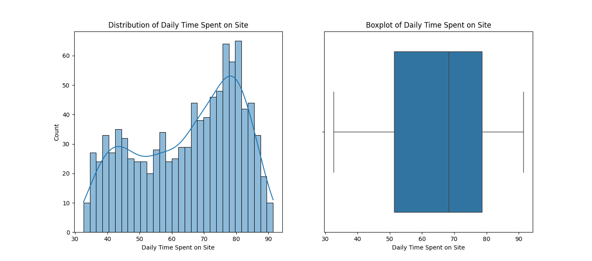
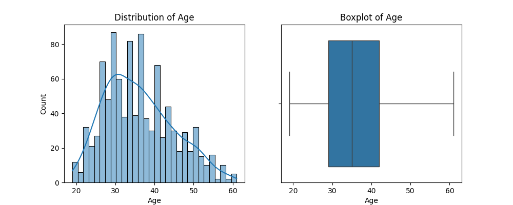
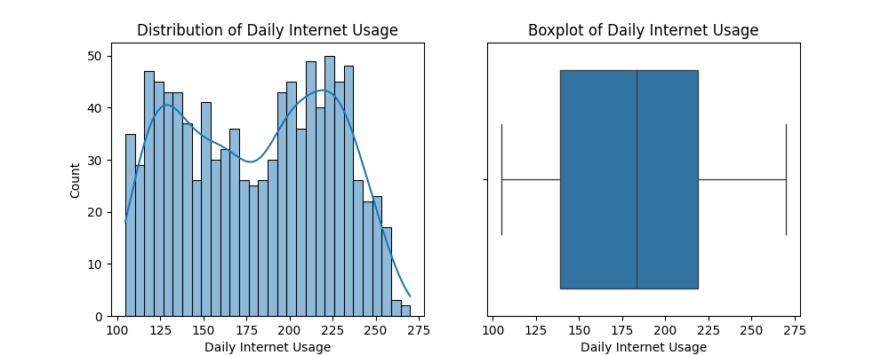
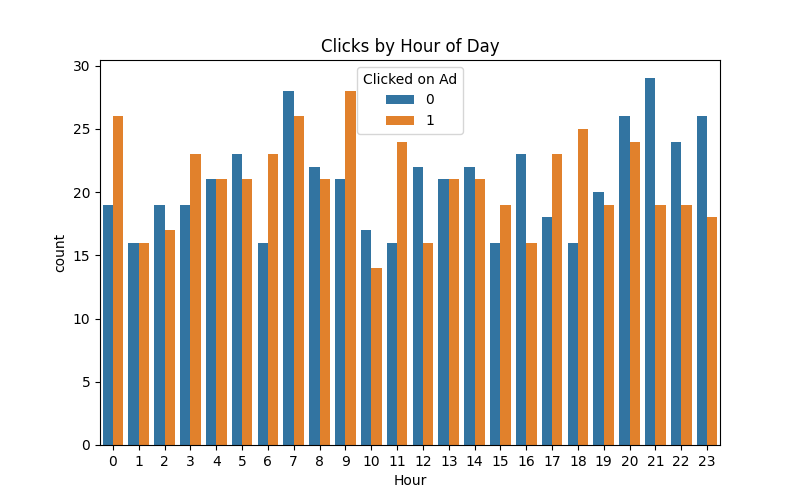
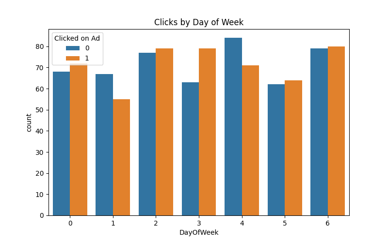
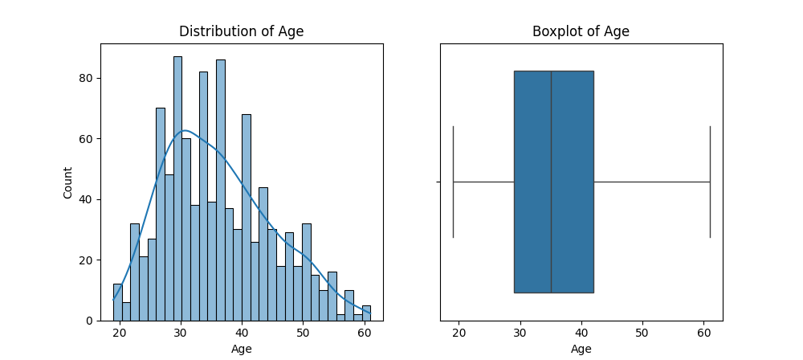
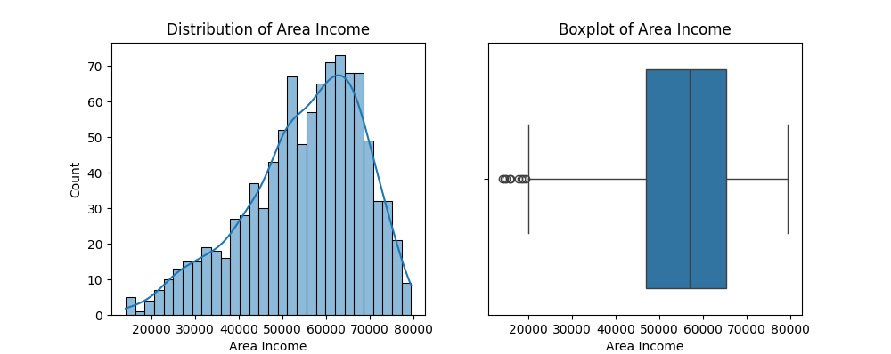
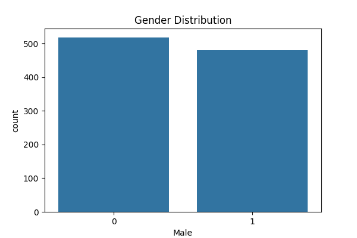

# Clickbait-Peak (CTR Prediction for ConnectSphere Digital)

Predicting which users are likely to click ads using real web analytics data and logistic regression.  

See `documentation.md` for full modeling process, code snippets and EDA

## Quickstart
1. Clone repo and install dependencies:
   pip install -r requirements.txt
2. Run EDA and modeling scripts.
3. Full results, plots, and performance details in `documentation.md`.

**Screenshots:**  

## License
MIT

For questions: Nitish Sehgal / scholzisshit@gmail.com
